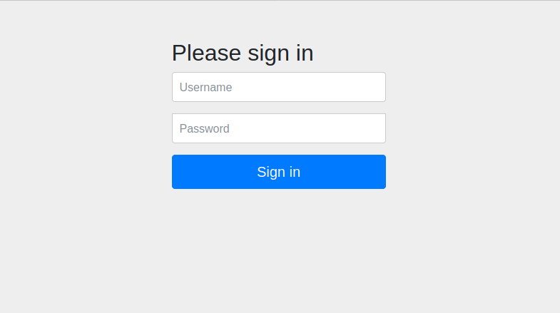

# com.dev.cinema

[Project purpose](#project-purpose)

[Project structure](#project-structure)

[Launch guide](#launch-guide)

[Author](#author)

### Project purpose

Web spring **cinema tickets service** sample with basic features.

       
This project has been build with MVC pattern with levels:

- Entity classes, DTOs and DTOMappers
- DAO (CRUD-operations)
- Service
- Controllers
- Spring configuration classes

### Project structure

* Java 11
* Maven 3.8.0
* Hibernate
* Spring WEB
* Spring Security
* log4j 1.2.17
* maven-checkstyle-plugin

### Launch guide

_To run this project you need to install:_

- <a href="https://www.oracle.com/java/technologies/javase-jdk11-downloads.html">JDK 11 or higher</a>
- <a href="https://maven.apache.org/download.cgi">Apache Maven</a>
- <a href="https://tomcat.apache.org/download-90.cgi">Apache Tomcat</a>
- <a href="https://dev.mysql.com/downloads/installer/">MySQL RDBMS</a>

Add this project to your IDE as Maven project.

Add Java SDK 11 in project structure.

Configure Tomcat:

    Add artifact
    Add Java SDK 11

Change a path to your Log file in src/main/resources/log4j.properties on line 18.

To work with MySQL you need to:

    CREATE SCHEMA `ticket_booking` DEFAULT CHARACTER SET utf8
    Enter your own username and password in src/main/resources/db.properties class on lines 3-4

Run the project via Tomcat configuration.

Enjoy it!

### Author

[Anastasiia](https://github.com/ana-dav)